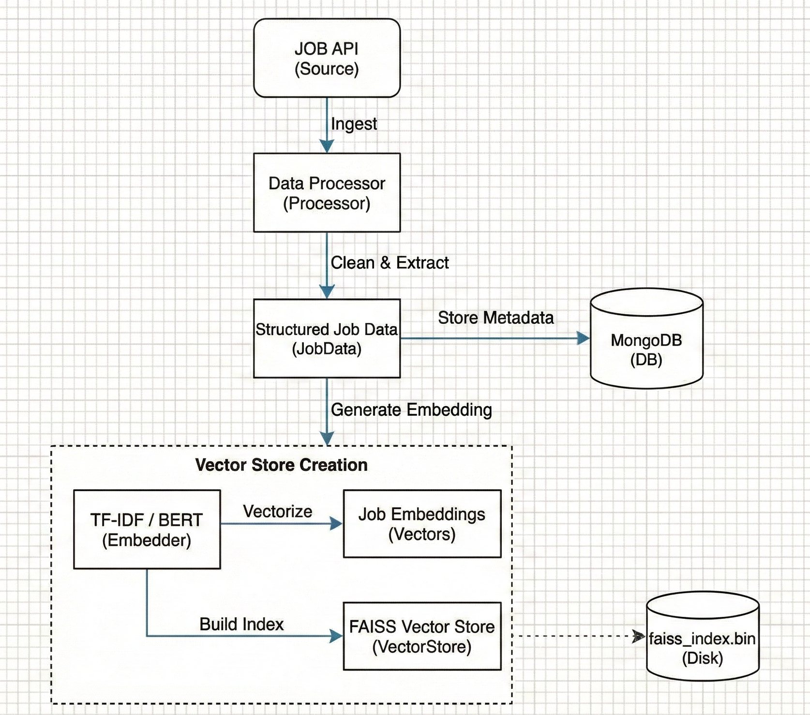
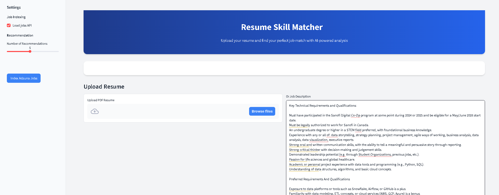
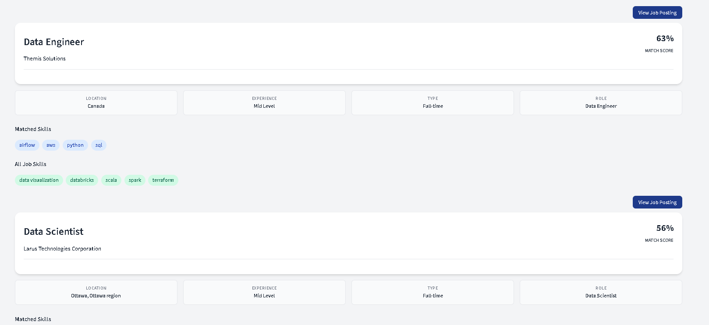

# Smart Resume Analyzer & Job Matcher

> **Automate your recruitment workflow with AI-powered resume parsing and intelligent job matching.**


---

## Project Context

SkillBridge AI is an end-to-end intelligent resume analysis and job-matching platform designed to support both recruiters and candidates. The system automates resume processing, extracts key skills and experience, and matches candidates to the company’s active job openings using semantic similarity and vector search.

By combining a real-time resume analysis pipeline with an offline job ingestion and embedding process, SkillBridge AI mirrors the workflows used by modern Applicant Tracking Systems (ATS) and internal recruitment platforms.

✔ For Recruiters (Internal Users)

- Recruiters can upload individual or bulk resumes and instantly view:

Structured candidate profiles

Extracted skills, keywords, and experience

Job match scores for open internal positions

Ranked recommendations across departments

This dramatically reduces manual screening time and improves consistency in evaluating candidates.

✔ For Candidates (External Users)

- Job seekers can upload their resumes through the web interface and immediately receive:
- A personalized list of recommended jobs within the company
- Skill-based match insights
- Suggested roles aligned with their experience

This creates a user-friendly experience similar to major job platforms.

## Key Features

- **PDF Resume Parsing**: Automatically extracts text, skills, and experience years from PDF documents.
- **Intelligent Matching**: Uses FAISS vector search to find the semantic match between resumes and job descriptions.
- **Candidate Profiling**: Structured data storage for every candidate in MongoDB.
- **Real-time Recommendations**: Get instant top-K job recommendations with match likelihood scores.
- **Interactive Dashboard**: A polished User Interface for seamless interaction.

---

## Data Ingestion Pipeline

The system uses a robust pipeline to ingest, process, and index job data:



## Real Time Pipeline Architecture


---

## Some User Interface

> **Place your Streamlit screenshots here to show off the interface.**





---

## Quick Start

### 1. Clone & Setup

```bash
git clone https://github.com/nirmal2i43a5/SkillBridge-AI.git
cd resume-matcher

# Create and activate virtual environment
python -m venv venv
# Windows
.\env\Scripts\activate

# Mac/Linux
source venv/bin/activate
```

### 2. Install Dependencies

```bash
pip install -r requirements.txt
```

### 3. Configure Environment

Create a `.env` file in the root directory:

```properties
MONGO_URI=mongodb+srv://<user>:<password>@cluster.mongodb.net/?retryWrites=true&w=majority
MONGO_USERNAME=<user>
MONGO_PASSWORD=<password>
MONGO_CLUSTER=<cluster_address>
APP_KEY=<jobs_api_key>
```

### 4. Run the Application

**Terminal 1 (Backend):**

```bash
python scripts/run_backend.py
```

**Terminal 2 (Frontend):**

```bash
python scripts/run_frontend.py
```

Visit **http://localhost:8501** to start matching!

---

## API Endpoints

The backend exposes the following RESTful endpoints (default port: `8000`):

| Method   | Endpoint                | Description                                   |
| :------- | :---------------------- | :-------------------------------------------- |
| `POST` | `/jobs/index`         | Index jobs into FAISS and MongoDB.            |
| `POST` | `/jobs/index/persist` | Persist jobs to MongoDB only (no indexing).   |
| `POST` | `/recommend/file`     | Upload PDF resume to get job recommendations. |
| `POST` | `/recommend/text`     | Paste resume text to get job recommendations. |

---

## Project Structure

```
resume-matcher/
├── frontend/             # Streamlit UI Application
│   ├── app.py           # Main Entry Point
│   └── static/          # Custom CSS
├── src/
│   ├── backend/         # FastAPI Application
│   │   ├── db/          # MongoDB & Models
│   │   ├── routes.py    # API Endpoints
│   │   └── services/    # Business Logic
│   ├── recommender/     # Matching Engine (FAISS)
│   ├── data_ingestion/  # Data Pipeline Scripts
│   └── preprocessing/   # Text & PDF Processing
├── data/                # Data Assets (Jobs JSON)
├── tests/               # Unit Tests
├── scripts/             # Runner Scripts
├── Dockerfile           # Docker Image Config
├── docker-compose.yaml  # Container Orchestration
└── requirements.txt     # Dependency List
```
