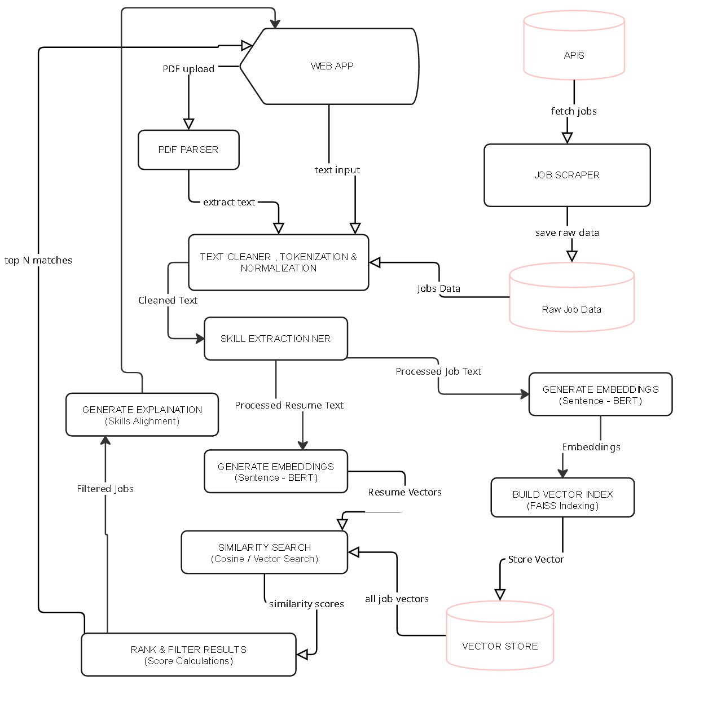

# Resume Skill Matcher

This document outlines the technical details of the Resume Skill Matcher application, a system designed to connect job seekers with relevant opportunities by analyzing their resumes against job postings.

## 1. Project Overview

The Resume Skill Matcher is an end-to-end system that parses resumes, extracts key skills, and recommends the most relevant job postings from a corpus. It features a web-based interface for resume submission and a RESTful API for managing job data and generating recommendations. The core of the system lies in its ability to generate semantic embeddings for both resumes and job descriptions, enabling efficient similarity-based matching.

## 2. System Architecture

The application is built on a decoupled frontend-backend architecture, containerized with Docker for portability and ease of deployment.

- **Frontend**: A Streamlit web application provides a user-friendly interface for uploading resumes (PDF or raw text) and viewing job recommendations.
- **Backend**: A FastAPI server exposes RESTful endpoints for indexing job postings and retrieving recommendations.
- **Recommender Engine**: The core logic, encapsulated within the backend, handles PDF parsing, text processing, skill extraction, embedding generation, and similarity search.
- **Data Storage**: Job postings are ingested from external sources (e.g., Adzuna API) and stored as JSON files. Vector embeddings are managed in-memory using FAISS for fast retrieval.

  

## 3. Component Breakdown

### 3.1. Frontend (`src/frontend/app.py`)

- **Framework**: Streamlit
- **Functionality**:
  - Allows users to upload a resume in PDF format or paste raw text.
  - Provides an interface to trigger the indexing of job postings from a predefined JSON file.
  - Displays a list of recommended jobs, including match score, company, location, and matched skills.
  - Communicates with the backend via HTTP requests to the FastAPI endpoints.

### 3.2. Backend (`src/backend/`)

- **Framework**: FastAPI**Key Endpoints** (`src/backend/routes.py`):
- - `POST /jobs/index`: Accepts a list of job postings in JSON format, processes them, and creates vector embeddings for storage.
  - `POST /recommend/text`: Takes raw resume text and returns a list of top matching job postings.
  - `POST /recommend/file`: Accepts a PDF file, extracts the text, and returns job recommendations.

### 3.3. Data Ingestion (`src/data_ingestion/`)The system can ingest job data from external sources like the Adzuna API.

- Ingested data is processed and stored in a structured JSON format (`data/processed/adzuna_data_jobs.json`).

### 3.4. Recommender Engine (`src/recommender/recommender.py`)

This is the core component responsible for the matching logic.

- **PDF Parsing** (`src/ocr/pdf_parser.py`): Extracts raw text from PDF resumes using `pdfplumber`.
- **Text Preprocessing** (`src/preprocessing/`):
  - `text_cleaner.py`: Cleans and normalizes the text from resumes and job descriptions.
  - `skill_extractor.py`: Identifies and extracts technical skills from the text.
- **Embedding Generation** (`src/embeddings/text_embedder.py`):
  - Uses the `multi-qa-MiniLM-L6-cos-v1` model from the `sentence-transformers` library to convert text into dense vector embeddings.
- **Vector Storage & Search** (`src/storage/vector_store.py`):
  - Employs `FAISS` (Facebook AI Similarity Search) for efficient in-memory storage and retrieval of job description embeddings.
  - Performs a similarity search (Inner Product) between the resume embedding and the indexed job embeddings to find the best matches.

## 4. Core Technologies

- **Backend**: Python, FastAPI
- **Frontend**: Streamlit
- **ML/NLP**:
  - `sentence-transformers`: For generating semantic embeddings.
  - `faiss-cpu`: For high-speed similarity search.
  - `scikit-learn`: For utility functions.
  - `numpy`, `pandas`: For data manipulation.
- **PDF Processing**: `pdfplumber`, `PyPDF2`
- **Containerization**: Docker, Docker Compose

## 5. Setup and Usage

1. **Prerequisites**: Docker and Docker Compose must be installed.
2. **Installation**: Clone the repository and build the Docker containers:
   ```bash
   git clone https://github.com/nirmal2i43a5/Skill-Match.git
   cd resume-skill-matcher
   docker-compose build
   ```
3. **Running the Application**:
   ```bash
   docker-compose up
   ```
4. **Accessing the Services**:
   - **Frontend**: `http://localhost:8501`
   - **Backend API Docs**: `http://localhost:8000/docs`
